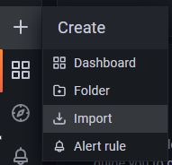

## Desafio DevOps - Renato Bettini


O objetivo desse desafio é termos um cluster [Kubernetes na AWS](https://aws.amazon.com/eks/) e dentro dele ter uma ferramenta onde conseguimos medir a latência entre os nodes do cluster. Tudo provisionado usando [Terraform](https://www.terraform.io/)

#### Pré requisitos
- Conhecimento dos serviços e operação AWS
- Execução dos instaladores em Sistema Linux
- Necessário ter instalado e configurado o [GIT](https://git-scm.com/book/en/v2/Getting-Started-Installing-Git), [AWS CLI](https://docs.aws.amazon.com/cli/latest/userguide/getting-started-install.html), [KUBECTL](https://kubernetes.io/docs/tasks/tools/install-kubectl-linux/) e [TERRAFORM](https://learn.hashicorp.com/tutorials/terraform/install-cli) no seu servidor de execução. A comunicação com sua conta precisa estar validada e estabilizada entre o servidor de execução e a AWS.
- Os workers do Kubernetes precisam ter no mínimo 2 cpus e 4gb de ram cada para suportar a carga de workloads que o projeto vai subir.

#### Considerações
- O cluster está programado para ser provisionado na região us-east-1 (N.Virginia). Altere as configurações caso queira provisionar em outra região. Verifique também se o tipo de instância a ser provisionado é disponibilizado na região escolhida (t2.medium).
- Esta instalação está documentada para execução sem orquestração via pipeline (jenkins, argo, git, etc). Portanto a execução deve ser disparada diretamente do servidor Linux (estimulado ou programado).

#### Topologia do cluster


- 1 VPC
- 2 Availability Zones
- 1 Private e 1 Public Subnet em cada AZ
- 2 NAT Gateway
- 1 External NLB e 1 Internal NLB
- 1 Internet Gateway
- 1 Private Route Table em cada AZ
- 1 Public Route Table
- 1 Cluster EKS

O cluster será criado com um node group de 2 workers, sendo um em cada availability zone para atender requisitos de disponibilidade e resiliência da solução.

#### Instalação

- Clone do repositório

    ``` git clone https://github.com/rbettini/eks-profana.git  ```


- Dentro do diretório terraform, executar os comandos de preparação e instalação do cluster EKS

    ``` terraform init ```

    ``` terraform plan ```

    ``` terraform apply -auto-approve ```

    Pronto! Seu cluster está provisionado na AWS. Deve apresentar a mensagem abaixo:
    
    *Apply complete! Resources: 25 added, 0 changed, 0 destroyed.*
    
    Agora segue as configurações de acesso ao cluster e deploy dos serviços.


- Dentro do diretório k8s, executar o comando abaixo para configurar os componentes de acesso:

    - Join no cluster via kubectl
    - LoadBalancers
    - Kubernetes Dashboard
    
    ``` ./1-prepare_k8s.sh ```


- O comando abaixo permite visualizar a url de acesso a console do Kubernetes:

    ``` kubectl get svc -n kubernetes-dashboard ```

    A url aparecerá na coluna EXTERNAL-IP. Basta copiar e colar no seu navegador acrescentando o https:// na frente.


- O comando abaixo permite que você capture o token para login na console:

    ``` kubectl get secret $(kubectl get serviceaccount dashboard -o jsonpath="{.secrets[0].name}") -o jsonpath="{.data.token}" | base64 --decode ```


- Dentro do diretório k8s, executar o comando abaixo para instalação do Prometheus e Grafana
    
    ``` ./2-prepare_profana.sh ```


- O comando abaixo retorna o status dos pods. Precisam estar todos com status Running.
 
    ``` kubectl get pods --all-namespaces ```


- O comando abaixo permite visualizar a url de acesso a console do Grafana e Prometheus:

    ``` kubectl get svc -n monitoring ```

    A url aparecerá na coluna EXTERNAL-IP. Basta copiar e colar no seu navegador acrescentando o http:// na frente.

    Para a URL do Grafana, incluir a porta 3000 no final.
    Para a URL do Prometheus, incluir a porta 9090 no final.

    Exemplo Grafana:
    http://a636a81cd484c4467bc1dc6af634cbc5-497763391.us-east-1.elb.amazonaws.com:3000

    Exemplo Prometheus:
    http://a192c9f58164140f59dbcf7182de4483-1343462760.us-east-1.elb.amazonaws.com:9090

    O primeiro acesso na console do Grafana, utilizar usuário e senha admin. Será solicitado nova senha.


- Após acessar o Grafana, importe o dashboard de monitoramento.

    Vá na opção abaixo e clique em import;

    

    Clique em Upload JSON File;
    Escolha o arquivo node_traffic_dashboard.json que está dentro do diretório k8s/kube-prometheus;
    E para finalizar clique em Import.

    Pronto! O cluster está ativo, configurado e monitorado!


#### Apagando todo o cluster

- Dentro do diretório k8s, executar o comando abaixo para remoção dos serviços de loadbalancer do Kubernetes
    
    ``` ./3-destroy_svc.sh ```

- Dentro do diretório terraform, executar o comando abaixo para remoção dos serviços da AWS
    
    ``` terraform destroy -auto-approve ```

    Pronto! Seu cluster foi destruído na AWS. Deve apresentar a mensagem abaixo:
    
    *Destroy complete! Resources: 25 destroyed.*
